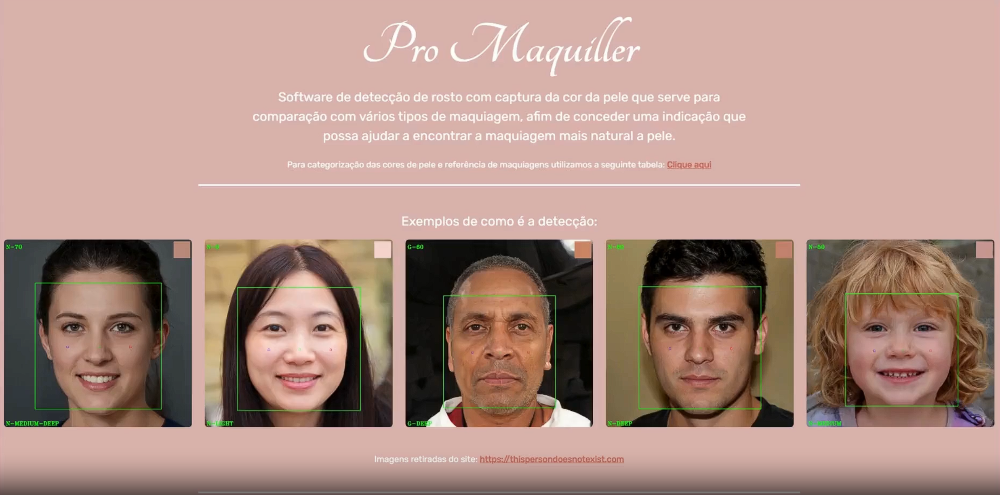
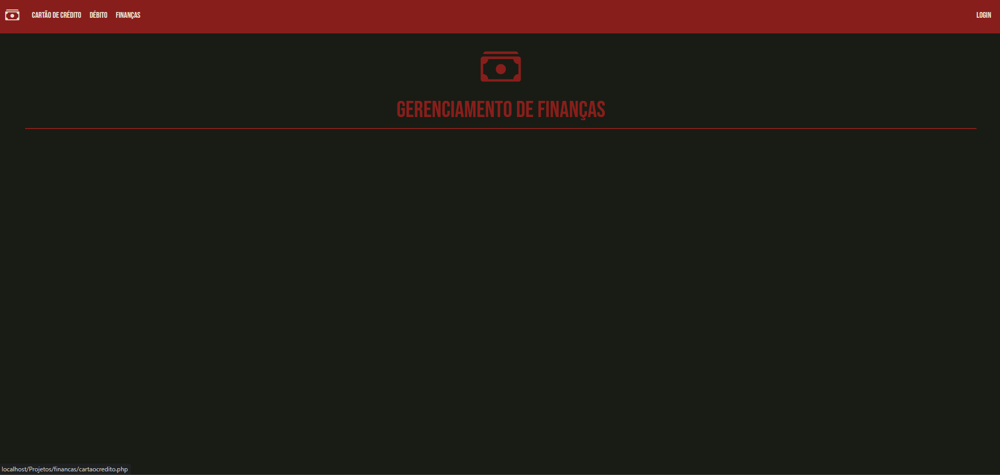
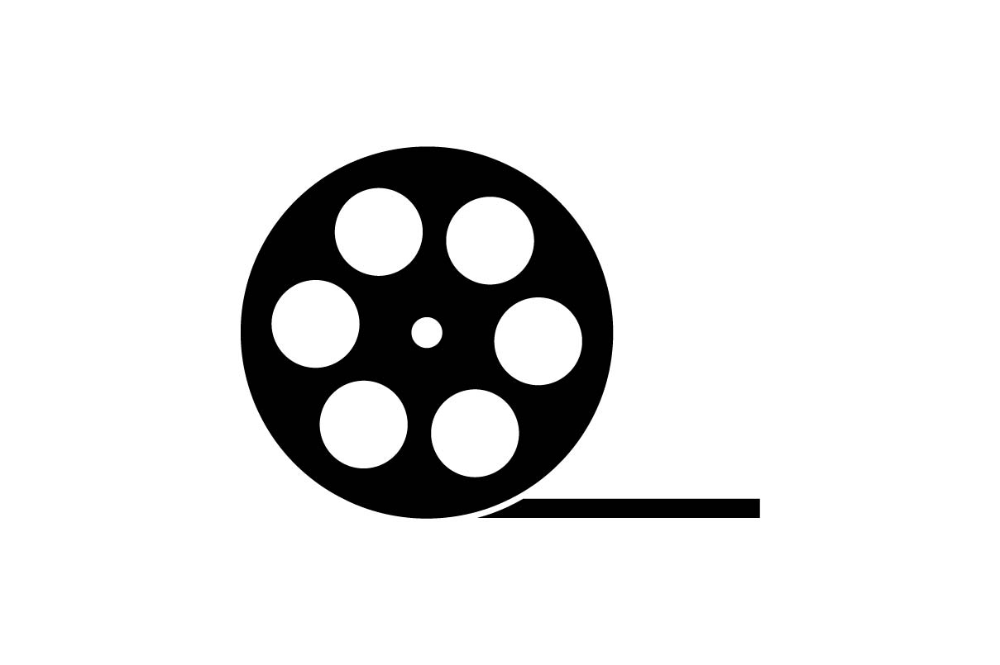

# 💻 Portfólio de Henrique Freitas

  

  
  
  

---

## 🙋‍♂️ Sobre Mim
Desde que comecei na programação, sempre gostei de transformar ideias e problemas em soluções reais. Poucas coisas são tão satisfatórias quanto resolver desafios, encontrar a causa de um problema em um sistema ou desenvolver funcionalidades que realmente façam diferença no dia a dia. 

Tenho grande interesse em desenvolvimento web, criação de interfaces e automação de processos, buscando constantemente aprender novas tecnologias, aprimorar minhas habilidades e evoluir como desenvolvedor.

---

## 🛠️ Tecnologias e Conhecimentos

  
  
  
  
  

  
  
  
  

---

## 💼 Principais Projetos Profissionais
*(Sistemas desenvolvidos para uso interno corporativo)*

### 🏛️ CREMESP
* **Reestruturação do Front-End Home:** Reestruturação completa da homepage do site institucional utilizando **Bootstrap 5** e **JavaScript moderno**. Focado em preparar a interface para migração de sistema, entregando responsividade e alinhamento com boas práticas de UI/UX.

### 🏢 Royal Tecidos
* **Reestruturação da Tela de Pedidos:** Implementação de novas regras de negócio, validações e travas operacionais na inserção de itens, adaptando o estoque aos diferentes métodos de venda com foco em segurança e estabilidade.
* **Fluxo de Liberação de Venda:** Desenvolvimento de um fluxo integrado entre rotinas de importação (acompanhamento de contêineres/Canal Verde) e a equipe comercial, agilizando análise de crédito e reduzindo processos manuais.
* **Distribuição de Pedidos:** Criação de uma tela logística para distribuição inteligente de mercadorias entre lojas do mesmo grupo comercial.
* **Tela para Feira de Roupas:** Solução de alto desempenho para vendas rápidas em eventos utilizando base de dados auxiliar para evitar gargalos no sistema principal.
* **Reestruturação da Tela de Embarques:** Migração de uma planilha antiga de gestão de compras para uma arquitetura organizada em **MVC**, melhorando drasticamente a usabilidade do departamento de importação.

---

## 🚀 Projetos Pessoais

<table>
  <tr>
    <td width="50%" valign="top">
      <h3>✨ Pro-Maquiller</h3>
      
      
Software de detecção facial para identificação de tons de pele e compatibilidade de maquiagem. Apresentado e destacado na Expo São Judas.

      
<code>Python</code> <code>HTML5</code> <code>CSS3</code>

      <a href="https://github.com/gabrielmaireno/Pro-Maquiller">Ver repositório →</a>
    </td>
    <td width="50%" valign="top">
      <h3>⏰ Batida Certa</h3>
      
      
Sistema inteligente para controle de ponto e banco de horas utilizando biblioteca de calendário, registros via AJAX/jQuery e backend estruturado.

      
<code>PHP</code> <code>MySQL</code> <code>JavaScript</code> <code>Bootstrap</code>

      <a href="https://github.com/HickysDev/Batida_Certa">Ver repositório →</a>
    </td>
  </tr>
  <tr>
    <td width="50%" valign="top">
      <h3>📊 Sky Finance</h3>
      
      
Plataforma para organização financeira pessoal, controle de cartões de crédito, fechamento de faturas e acompanhamento mensal de despesas.

      
<code>PHP</code> <code>MySQL</code> <code>jQuery</code> <code>AJAX</code>

      <a href="https://github.com/HickysDev/Sky_Finance">Ver repositório →</a>
    </td>
    <td width="50%" valign="top">
      <h3>🎬 Aplicativo de Cinema</h3>
      
      
Aplicativo focado em buscar e exibir filmes em cartaz nos cinemas mais próximos com base na localização do usuário. Desenvolvido para a Expo São Judas.

      
<code>Java</code> <code>Android</code>

      <a href="https://github.com/HickysDev/cinemaA3">Ver repositório →</a>
    </td>
  </tr>
</table>

---

## 🎯 Objetivos e Estudos
Meu objetivo é continuar evoluindo profissionalmente, participando de projetos desafiadores que me permitam desenvolver soluções criativas e eficientes. Busco crescer tanto tecnicamente quanto profissionalmente, sempre aprendendo novas tecnologias e expandindo minha experiência no desenvolvimento web.

---

## 🎨 Sobre este Portfólio (Interface)
Este repositório contém o código-fonte do meu site portfólio, construído para ser dinâmico, moderno e responsivo. 
* **Animações:** Utiliza `Animate.css` e `AOS (Animate On Scroll)` para interações fluidas.
* **Efeitos Visuais:** Efeito de partículas em background através do `particles.js`.
* **Dinamismo:** Efeito de digitação com `Typed.js` e tooltips otimizados com `Tippy.js`.
* **Navegação:** Menu inteligente utilizando o Scrollspy do `Bootstrap 5`.

---
⭐ _Portfólio desenvolvido por [Henrique Freitas](https://github.com/HickysDev)_
